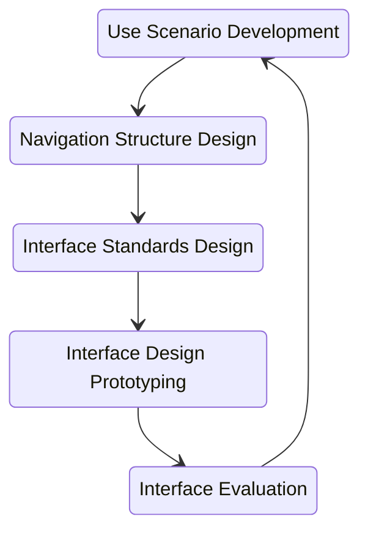

# Software Engineering I Chapter 10 : Human–Computer Interaction Layer Design
---
## LCA UCM
- **Layout**
	- self-contained
	- natural intuitive flow
		- left to right and top to bottom
		- etc.
- **Content Awareness**
	- titles & labels of fileds
	- where user is
	- version or date
- **Aesthetics**
	- inviting to use
	- minimalist
	- White space
	- informaltion density
		- Novie < 50%
		- Expert > 50%
	- Text
		- size
		- Avoid capital
	- Color
		- Most Readable: black on White
		- Least Readable: blue on red
- **User Experience**
	- Ease of learning : large user population
	- Ease of use : specialized systems
	- Complementary or Conflicting
- **Consistency**
	- users to predict what is going to happen
	- All parts work in same way
		- Navigation controls
		- Terminology : same descriptors
- **Minimal User Effort**
	- Three-click rule
---
## User Interface Design Process

#### Use Scenario Development
- steps performed by users
- Use case: Detail, Essential -> Detail, Real

#### Navigation Structure Design
- How they work together
- Windows Navigation Diagrams (WND)

#### Interface Standards Design
- __Interface metaphor__ : concept from the real world
- __Interface objects__ : names of objects
- __Interface actions__ : names of commands
- __Interface icons__ : pictures on buttons, reports, and forms
- __Interface templates__ : basic layout

#### Interface Design Prototyping
- Mock-ups of simulations
- Common approaches
	- Storyboard
	- Windows layout diagram
	- HTML prototype
	- Language prototype

#### Interface Evaluation
- **Heuristic** : compare the design to known principles
- **Walkthrough** : presents prototype to the users & explains
- **Interactive** : users work in a one-person session with <u>team member</u>
- **Formal usability testing** : performed in labs with <u>users working without help</u>
---
## Common Sense
- Users should not have to think
- number of clicks should relate to the complexity of the task
- Minimize the number of words
---
## Navigation Design
- Prevent the user from making mistakes
- Simplify recovery
- consistent grammar order

#### Type of navigation controls
- ** Hardware**
-  **Software**
	-  Language
	-  Menus
	-  Direct manipulation
	-  Voice recognition

#### Message
- <u>Error</u>
	1. Tell what's wrong
	2. Tell how to fix
- Confirmation
	- Example: delete file
- Acknowledgment
	- What have done
- Delay
	- process is running
- Help
	- additional information

#### Navigation design documentation
- using **WNDs** and **real use-cases**
- **Real use-cases** are implementation dependent
---
## Input Design
#### Data
- **Striuctured**: Dates, names, products, etc.
- **Unstructured**: Comments, descriptions

#### Basic principles
- Online processing: Collect each, then process
- batch processing: Collect all, then process.
- Capture data at the source
	- Manual
	- Automation (reader)
- Minimize keystrokes
	- default value
	- choices

#### Types of inputs
- **Free form controls**
	- Text boxes
	- Number boxes
	- Password boxes
		- hide characters with stars
		- not allow cutting or copying
- **Selection boxes**
	- Check boxes
	- Radio buttons
	- List boxes
	- Sliders

#### Input validation
- Completeness
- Format
- Range - min/max
- Check sum digit - reduces error
- Consistency - related
- Database check - entity & referntial integrity
---
## Output Design
#### Basic principles
- Understand report usage & layout
- Manage the information load
	- what is needed
	- most important near the top
- Minimize bias

#### Type of Reports
1. **Detail report**: Lists detailed information about <u>all</u> items
2. **Summary report**: Lists summary information
3. **Turnaround documnet**: Outputs that "turn around" and become inputs
4. **Graphs**: Charts instead of tables of numbers

## Non-Functional Requirements Influence on HCI
- Operational Requirements
- Performance Requirements
- Security Requirements
- Political & Cultural Requirements

---