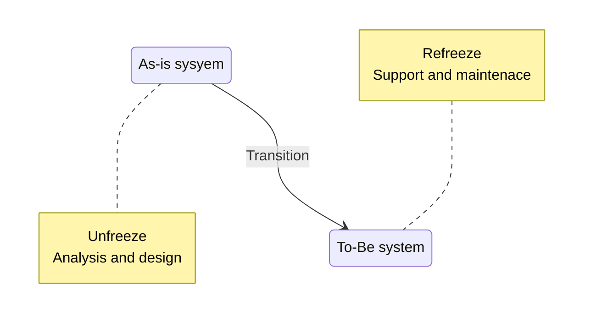
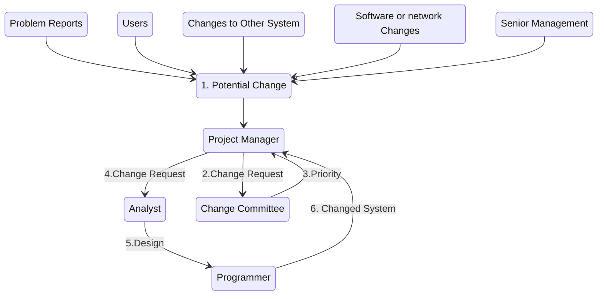

# Software Engineering I Chapter 13 : Installation and Operations
---

## Model for Implementinh Change

- **Unfreeze**
	- Analysis and design : unfreeze existing habits and norms
	- Aware of <u>current problems</u> and have sense of potential <u>benefits of new system</u>
- Move via** migration plan**
	- <u>Technical conversion</u> : system installation and data migration
	- <u>Change management</u> : focus on people
- **Refreeze**: key goal of post-implement
	- standard way of performing business function
	- System support
	- System maintenance : 60-80% budget
	- Project assessment




#### Cultural Issues
- **Speed of messages**
	- fast and shallow cultures - online documentation and training
	- slow and deep cultures = understanding of new system
- **Context**
	- High context cultures - documentation and training
		- how system fits <u>entire</u> enterpise-wide system
- **Time**
	- Ploychronic time cultures (do multiple things at same time)
		- longer period
	- monochromic time cultures
		- small set of intense sessions
- **Power distance**
	- High power distance
		- superior has absolute power
	- Low power distance
		- more paticipant
- **Uncertainty avoidance**
	- detailed manuals and good training
- **Individualism vs. collectivism**
	- benefit to individual or group
- **Masculinity vs. femininity**
	- masculine cultures: advancement, earnings, training
	- feminine cultures: friendly atmosphere
- **Long- vs. short-term orientation**
	- short-term: other department as competitive
	- long-tern: other as support


---
## Element of Mugration Plan

```mermaid
classDiagram
class Conversion_Plan{
	Install hardware
	Install software
	Covert data
	(Technical Issues)
}
class Change_Management_Plan{
	Revise management policies
	Assess costs and benefits
	Motivate adoption
	Conduct training
	(Organizational Issues)
}
class Commence_Operations

Conversion_Plan --> Commence_Operations
Change_Management_Plan --> Commence_Operations
```
---
## Conversion
a new system replaces an old system
#### Three major steps
- Buy & Install hardware
- Install software
- Convert data

#### Conversion dimensions
- Conversion style
- Conversion location
- Conversion modules

##### Conversion style
- **Direct**
	- new system <u>instantly</u> replaces old system
	- Simplest but undetected problems during test
- **Parallel**
	- new and old systems operate <u>side by side</u>
	- More likely to find bugs, but added expenses

##### Coversion location
- **Pilot**
	- One or more are converted first
	- probelms only at pilot location
	- difficult to excahnge data
- **Phased**
	- first set of locations
	- Similar to Pilot
- **Simultaneous**
	- All locations are converted
	- Sufficient staff needed to convert and train all

##### Conversion module
- **Whole system**
	- Entire system
	- difficult for large complex system to learn
- **Modular**
	- One module at a time
	- Each module must be written to work both new and old
	- Easier for loose association between modules
	- longer time to convert

<table><thead><tr><th></th><th colspan="2">Conversion Style</th><th colspan="3">Conversion Location</th><th colspan="2">Conversion Modules</th></tr></thead><tbody><tr><td>Characteristic</td><td>Direct</td><td>Parallel</td><td>Pilot</td><td>Phased</td><td>Simultaneous</td><td>Whole-system</td><td>Modular</td></tr><tr><td>Risk</td><td>H</td><td>L</td><td>L</td><td>M</td><td>H</td><td>H</td><td>M</td></tr><tr><td>Cost</td><td>L</td><td>H</td><td>M</td><td>M</td><td>H</td><td>M</td><td>H</td></tr><tr><td>Time</td><td>Short</td><td>Long</td><td>M</td><td>Long</td><td>Short</td><td>Short</td><td>Long</td></tr></tbody></table>

--- 

## Change management
Three key roles
- The sponsor of change - who wants change
- The change agent - leading change
- Potential adopters - targets of change

#### Resistance to Change
- Good for organization often not good for people
- **personal cost-benefit analysis**
	- weighted by amount of uncertainty
	- overestimate cost and underestimate benefits
	- transition process cost
- benefits outweigh costs -> people change

#### Revising Management Policies
- Provide goals
- Define work processes
- Determine reward

>No successfully adopted unless management policies support

###### Tools
- Standard Operating Procedures
	- revised to match to-be system
- Measurements and Rewards
	- design to motivate desired behavior
- Resource Allocation
	- Direct effect: actual reallocation of resources
	- Symbolic effect: make it serious

#### Assessing Costs & Benefits
- **Organization**
	- compare with as-is
- **Potential adopters**
	- personal cost-benefit

> People need to be convinced that what has worked in the past may not work in the future


#### Factors for successful change
- **Benefits of to-be system**
	- Compelling personal reason for change

 - **Cerainty of benefits**
	- Compelling organizational reason for change
	- Demonstrated top management support
	- Committed and involed business sponsor
	- Credible top managment and business sponsor

- ** Costs of transition**
	- Low personal costs of Change

- **Cerainty of costs**
	- Clear plan for change
	- Credible change agent
	- Clear mandate for change agent from sponsor

#### Moticating Adoption
Two basic strategies to motivate adoption
- ** Informational strategy**
	- memos and presentations (email or session)
- **Political strategy**
	- Use organization power

> Support and encourage the ready adopters and help them win over the reluctant adopters

> 20-30% ready adopters, 20-30% resistant adopters, 40-60% reluctant adopters

#### Enabling Adoption: Training
Provide the skills to adopt the change
- focus on helping the users accomplish their jobs
- focus on what the user needs to do, <u>not system is capable</u>

Train
- Classroom training
- One on one
- Computer based training(CBT)

|                 | One-on-One | Classroom | Computer-Based |
|-----------------|:----------:|:---------:|:--------------:|
| Cost to develop |     L-M    |     M     |        H       |
| Cost to deliver |      H     |     M     |        L       |
| Impact          |      H     |    M-H    |       L-M      |
| Reach           |      L     |     M     |        H       |

---
## Post-implementation Activities
- institutionalize the new system
	- the normal & accepted routine
	- “Refreeze”
- job of the project sponsor and manager
	- Actively promote & monitor
	- Provide steady flow of information
- Activites:
	- System support
	- System maintenance
	- Project assessment

#### System Support
###### Type
- Online support
- Help desk
	- **Level 1** support
		- Unable to solve: Generate a problem report or ticket to **Level 2** support staff
	- Most are solved at level 2
		- bug -> change request to <u>system maintenance group</u>
###### Elements of a problem report
- Time/date of the report
- Contact of support person 
- Contact of person who reported
- Software and/or hardware causing problem
- Location of the problem
- Description of the problem
- Action taken
- Disposition (problem fixed or forwarded to system maintenance)


#### System maintenance
- make sure it continues to meet business needs
- More expensive than initial development
- **Change requests** are smaller versions of a system request
	- sources
		- Problem reports: bugs
		- Users:enchancement, minor design change
		- Other projects: interface between two systems
		- Underlying software: e.g. new version of OS
		- Senior management: e.g. organization strategy or operation changed



#### Project Assesment
what was successful and what needs to be improved
###### Project Team Review
-  <u>immediately</u> after the system is installed
- what worked and mistakes
- a “lessons learned” document
- repeat excellent performance and eliminate mistakes in future
###### System Review
- <u>iseveral months</u> after the system is installed
- what analysis are actually recognized in the implemented system
- <u>compare estimates with actual values</u>
- baseline costs for future projects
